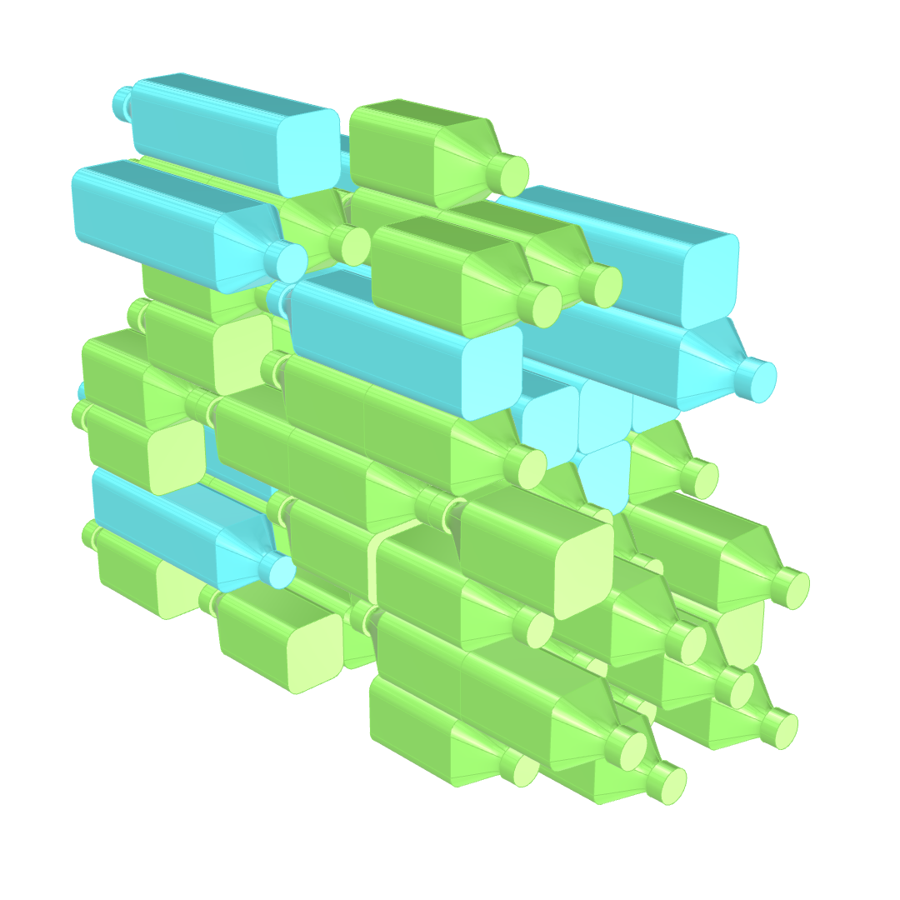

# Reclaimed Design Systems

Design systems developed during the AAVS26 Reclaim Seoul Workshop.

This repository collects reusable aggregation/design systems for material reuse workflows. Each system is stored as a folder inside `systems/`, with its own metadata, aggregation data, thumbnail, and generated documentation.

## Available systems

<!-- CATALOG:START -->
<!-- This section is automatically generated. Do not edit manually. -->

| Preview | System |
|---|---|
|  | [Multi-Bottle System](systems/bottles-system/)<br><br>A system for reusing bottles with different sizes<br><br>by Andrea Rossi<br>[aggregation.json](systems/bottles-system/aggregation.json) · [meta.json](systems/bottles-system/meta.json) |
|  | [Test system](systems/test-system/)<br><br>A system for reusing bottles with different sizes<br><br>by Andrea Rossi<br>[aggregation.json](systems/test-system/aggregation.json) · [meta.json](systems/test-system/meta.json) |

<!-- CATALOG:END -->

## Repository structure

```txt
systems/
  <system-slug>/
    aggregation.json
    meta.json
    00_thumb.png
    README.md

catalog/
  catalog.json

scripts/
  build_catalog.mjs
